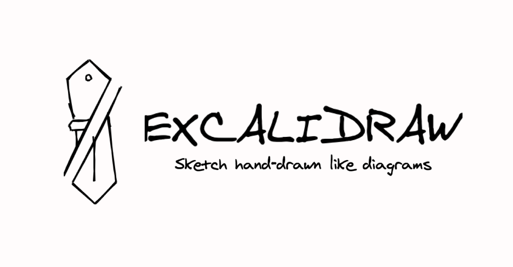

<!-- sectionTitle: What is Excalidraw? -->

## Excalidraw とは

https://excalidraw.com/

---

手書きのように見えるダイアグラムを作成できるツール

 

---

Christopher Chedeau さんが 2020/1/1 から作り始めた

 

[codesandbox でプロトタイプを作ったときの Tweet](https://twitter.com/Vjeux/status/1212503324982792193)

[Initial commit](https://github.com/excalidraw/excalidraw/commit/ec23829fce40fdc0897c966405d265c3e9883f72)
