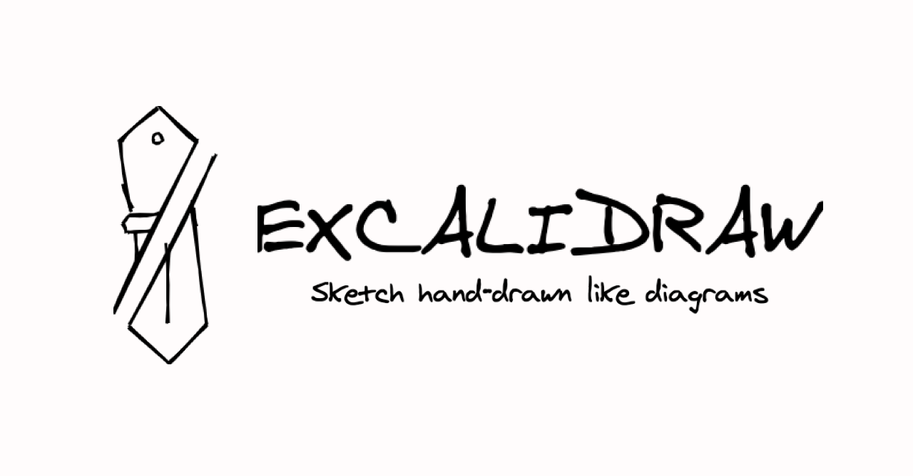

<!-- sectionTitle: Excalidraw -->

## Excalidraw

<br />



<br />

https://excalidraw.com/

---

## Excalidraw とは

<br />

手書きのように見えるダイアグラムを作成できるツール

2020/1/1 から開発開始された
<br />

[Initial commit](https://github.com/excalidraw/excalidraw/commit/ec23829fce40fdc0897c966405d265c3e9883f72)

---

## 開発者

Christopher Chedeau

Facebook のエンジニアで、Facebook が開発している yoga というクロスプラットフォームレイアウトエンジンの開発者でもある

---

<!-- note
graphqlはquery, mutation, subscriptionを持ちます。
queryはデータの取得
mutationはデータの変更
subscriptionはデータの購読
-->

## スキーマの例 [server]

```js
import { makeExecutableSchema } from 'graphql-tools';

const organizations = [
  { name: 'nodejs', url: 'u' },
  { name: 'facebook', url: 'l' },
];

const typeDefs = `
  type Organization {
    name: String!
    url: String!
  }

  type Query {
    organizations: [Organization]
    organization(name: String!): Organization
  }
`;
const resolvers = {
  Query: {
    organizations: () => organizations,
    organization: (obj, { name }) => organizations.find((o) => o.name === name),
  },
};

export const schema = makeExecutableSchema({ typeDefs, resolvers });
```

---

## 問い合わせの例 [client]

```html
<script>
  (async () => {
    const res = await fetch('/graphql', {
      method: 'POST', // "GET"を使う場合はbodyではなくquery stringへ追加
      headers: { 'Content-Type': 'application/json' },
      body: JSON.stringify({
        query: `{
          organizations {
            name
          }
        }`,
      }),
    }).then((res) => res.json());

    console.log(res.data.organizations);
    // [
    //  { name: "nodejs" },
    //  { name: "facebook" }
    // ]
  })();
</script>
```
